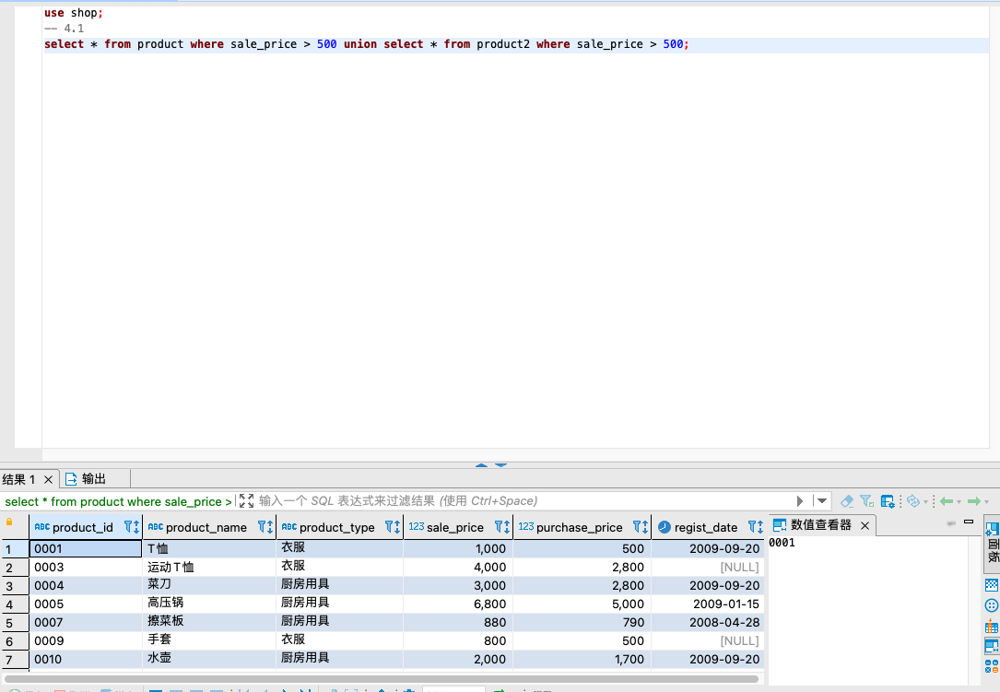
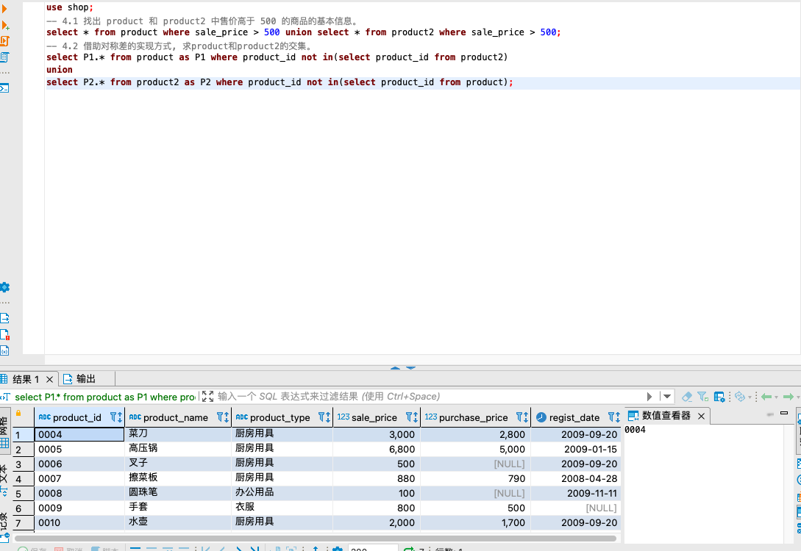
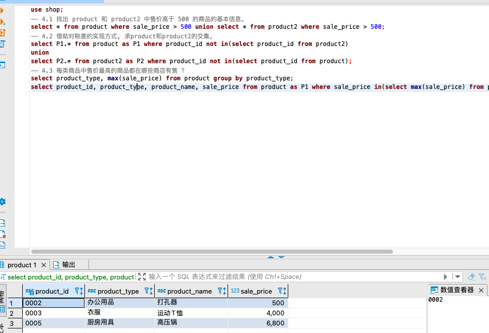
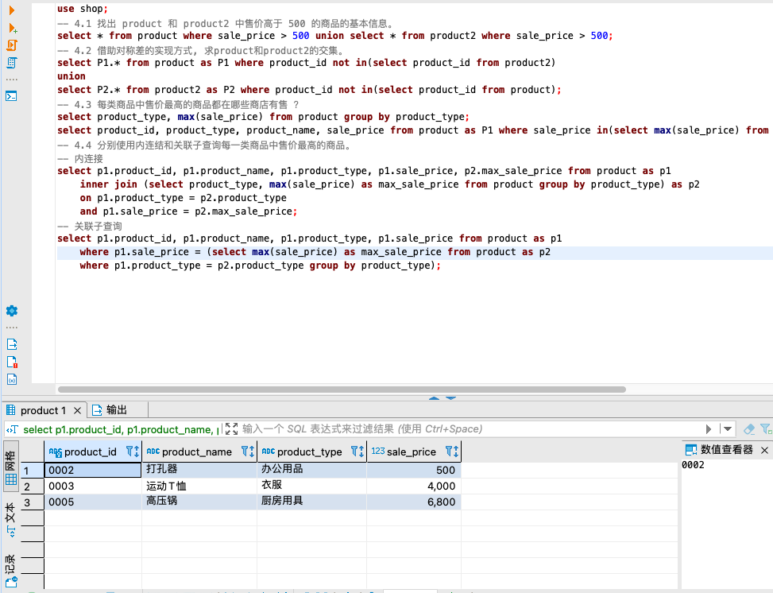
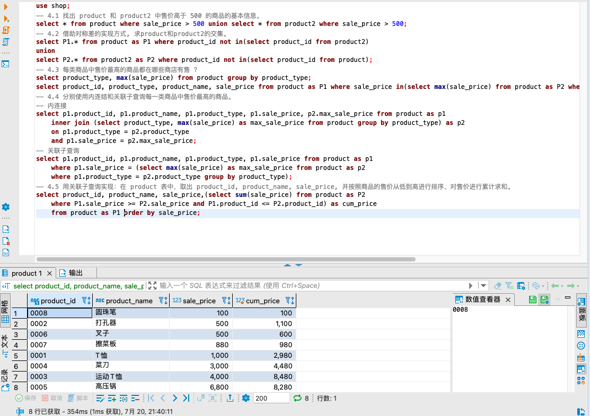

```sql
use shop;
-- 4.1 找出 product 和 product2 中售价高于 500 的商品的基本信息。
select * from product where sale_price > 500 union select * from product2 where sale_price > 500;
-- 4.2 借助对称差的实现方式, 求product和product2的交集。
select P1.* from product as P1 where product_id not in(select product_id from product2)
union
select P2.* from product2 as P2 where product_id not in(select product_id from product);
-- 4.3 每类商品中售价最高的商品都在哪些商店有售 ？
select product_type, max(sale_price) from product group by product_type;
select product_id, product_type, product_name, sale_price from product as P1 where sale_price in(select max(sale_price) from product as P2 where P1.product_type = P2.product_type group by product_type);
-- 4.4 分别使用内连结和关联子查询每一类商品中售价最高的商品。
-- 内连接
select p1.product_id, p1.product_name, p1.product_type, p1.sale_price, p2.max_sale_price from product as p1
	inner join (select product_type, max(sale_price) as max_sale_price from product group by product_type) as p2
	on p1.product_type = p2.product_type
	and p1.sale_price = p2.max_sale_price;
-- 关联子查询
select p1.product_id, p1.product_name, p1.product_type, p1.sale_price from product as p1
	where p1.sale_price = (select max(sale_price) as max_sale_price from product as p2
	where p1.product_type = p2.product_type group by product_type);
-- 4.5 用关联子查询实现：在 product 表中，取出 product_id, product_name, sale_price, 并按照商品的售价从低到高进行排序、对售价进行累计求和。
select product_id, product_name, sale_price,(select sum(sale_price) from product as P2
	where P1.sale_price >= P2.sale_price and P1.product_id <= P2.product_id) as cum_price
	from product as P1 order by sale_price;
```






